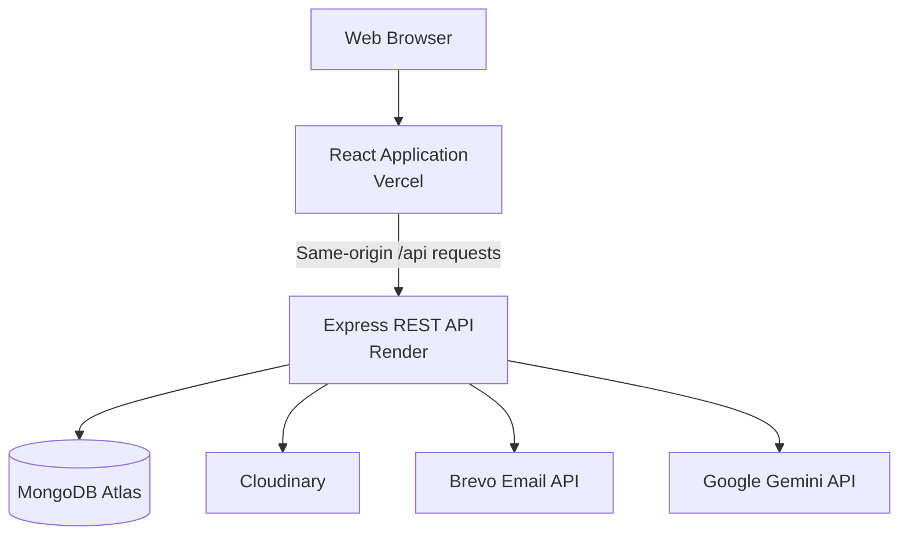

<div align="center">
  <div "white">
  
  </div>

  <h3>Connecting talent with the right opportunities.</h3>

  <p>
    A full-stack hiring platform combining a public job board,
    applicant tracking system, role-based hiring workflows,
    and AI-assisted recruitment tools.
  </p>

  <p>
    <a href="https://hireflow-hireflow4.vercel.app">
      <strong>Live Application</strong>
    </a>
    ·
    <a href="https://hireflow-api-sahil-pawar.onrender.com/api-docs">
      <strong>API Documentation</strong>
    </a>
  </p>
</div>

---

## About Hireflow

Hireflow is a production-deployed MERN hiring platform designed for
candidates, company administrators, and recruiters.

It combines job discovery, application management, company hiring
workflows, candidate recommendations, analytics, and AI-assisted
recruitment features in one responsive application.

The project was built with a backend-first architecture and includes
secure cookie-based authentication, role-based authorization,
transactional emails, media uploads, API documentation, automated
backend tests, and production deployment.

## Main Features

### Candidate experience

- Create and manage a candidate profile
- Upload and manage a profile image and resume
- Search and filter published jobs
- View detailed job information
- Apply for jobs
- Track submitted applications
- Set job preferences
- Receive personalized job recommendations
- Analyze a resume using AI
- Compare a resume against a job description
- Review strengths, gaps, and improvement suggestions

### Company administrator experience

- Create and manage a company profile
- Upload company branding and media
- Create, edit, publish, and manage jobs
- Review applicants for individual jobs
- Move applications through the hiring process
- Invite and manage recruiters
- View hiring analytics
- Review candidate resumes with AI
- Generate interview kits
- Generate job-post suggestions
- Receive AI-assisted shortlist recommendations
- Compare selected candidates

### Recruiter experience

- Access assigned company hiring workflows
- Review job applicants
- Update permitted application stages
- Use authorized recruitment tools
- Work within role-based company permissions

## AI-Assisted Hiring

Hireflow integrates Google Gemini for recruitment-focused workflows.

AI functionality includes:

- Candidate resume analysis
- Resume-to-job fit analysis
- Company-side resume review
- Job-post improvement suggestions
- Interview-kit generation
- Suggested candidate shortlists
- Candidate comparison

AI requests include usage limits, eligibility checks, validation,
cached-result handling, timeout protection, and structured responses.

## Authentication and Security

Hireflow uses secure, server-managed authentication rather than storing
JWTs in browser local storage.

Security features include:

- HttpOnly access and refresh-token cookies
- CSRF protection for state-changing requests
- Stable authentication sessions per login or device
- Refresh-token rotation
- Refresh-token reuse detection
- Current-device logout
- Logout from all devices
- Session revocation after password reset
- Role-based authorization
- Password hashing with bcrypt
- Request validation with Zod
- Helmet security headers
- Global and authentication-specific rate limiting
- Proxy-aware production rate limiting
- Restricted CORS configuration
- Request body-size limits
- Centralized error handling

## Technology Stack

### Frontend

| Technology      | Purpose                                  |
| --------------- | ---------------------------------------- |
| React           | User interface                           |
| Vite            | Development and production build tooling |
| React Router    | Client-side routing                      |
| Tailwind CSS    | Responsive styling                       |
| Axios           | API communication                        |
| React Hook Form | Form state management                    |
| Zod             | Client-side validation                   |
| Lucide React    | Interface icons                          |
| Sonner          | Toast notifications                      |

### Backend

| Technology         | Purpose                       |
| ------------------ | ----------------------------- |
| Node.js            | JavaScript runtime            |
| Express            | REST API framework            |
| MongoDB            | Application database          |
| Mongoose           | MongoDB object modelling      |
| JSON Web Tokens    | Authentication tokens         |
| Zod                | Request validation            |
| Vitest             | Automated testing             |
| Supertest          | API integration testing       |
| Swagger            | Interactive API documentation |
| Helmet             | HTTP security headers         |
| Morgan             | Request logging               |
| Express Rate Limit | Request throttling            |

### External services

| Service       | Purpose                            |
| ------------- | ---------------------------------- |
| MongoDB Atlas | Production database                |
| Cloudinary    | Profile, company, and resume media |
| Brevo         | Transactional email delivery       |
| Google Gemini | AI-assisted hiring features        |
| Vercel        | Frontend hosting                   |
| Render        | Backend API hosting                |

## Application Architecture



In production, the frontend sends requests to `/api`. Vercel rewrites
those requests to the Render backend. This keeps browser requests
same-origin and supports first-party authentication cookies.

## API Modules

The REST API is organized into the following modules:

- Authentication
- Companies
- Jobs
- Candidates
- Applications
- Analytics
- Recommendations
- AI features

Interactive documentation is available at:

- Production:
  `https://hireflow-api-sahil-pawar.onrender.com/api-docs`
- Local:
  `http://localhost:5000/api-docs`

Health endpoint:

```text
GET /api/v1/health
```

## Project Structure

```text
Hireflow/
├── backend/
│   ├── src/
│   │   ├── config/
│   │   ├── modules/
│   │   │   ├── ai/
│   │   │   ├── analytics/
│   │   │   ├── application/
│   │   │   ├── auth/
│   │   │   ├── candidate/
│   │   │   ├── company/
│   │   │   ├── job/
│   │   │   └── recommendation/
│   │   ├── shared/
│   │   ├── scripts/
│   │   ├── app.js
│   │   └── server.js
│   ├── tests/
│   ├── .env.example
│   └── package.json
│
├── frontend/
│   ├── public/
│   ├── src/
│   │   ├── api/
│   │   ├── assets/
│   │   ├── components/
│   │   ├── features/
│   │   ├── hooks/
│   │   ├── layouts/
│   │   ├── pages/
│   │   ├── routes/
│   │   └── utils/
│   ├── .env.example
│   ├── index.html
│   └── package.json
│
├── docs/
└── README.md
```

## Local Development

### Prerequisites

Install the following before starting:

- Node.js
- npm
- MongoDB, or a MongoDB Atlas connection
- Git

Accounts are also required for features that use:

- Brevo
- Cloudinary
- Google Gemini

### 1. Clone the repository

```bash
git clone https://github.com/sahil-2403/Hireflow.git
cd Hireflow
```

### 2. Install backend dependencies

```bash
cd backend
npm install
```

### 3. Configure the backend environment

Copy the example environment file:

```bash
cp .env.example .env
```

On Windows, create a `.env` file inside `backend` and copy the contents
of `.env.example` into it.

Configure the required values:

```env
NODE_ENV=development
PORT=5000

MONGO_URI=

API_BASE_URL=http://localhost:5000
CLIENT_URL=http://localhost:5173

ACCESS_TOKEN_SECRET=
REFRESH_TOKEN_SECRET=

BREVO_API_KEY=
EMAIL_FROM_ADDRESS=
EMAIL_BRAND_LOGO_URL=

CLOUDINARY_CLOUD_NAME=
CLOUDINARY_API_KEY=
CLOUDINARY_API_SECRET=

AI_ENABLED=true
AI_PROVIDER=gemini
GEMINI_API_KEY=
```

The complete configuration is documented in:

```text
backend/.env.example
```

Never commit the completed `.env` file.

### 4. Start the backend

```bash
npm run dev
```

The backend runs at:

```text
http://localhost:5000
```

### 5. Install frontend dependencies

Open a second terminal:

```bash
cd frontend
npm install
```

### 6. Configure the frontend environment

Create:

```text
frontend/.env
```

Add:

```env
VITE_API_BASE_URL=http://localhost:5000/api/v1
```

### 7. Start the frontend

```bash
npm run dev
```

The frontend runs at:

```text
http://localhost:5173
```

## Available Commands

### Backend

Run the development server:

```bash
npm run dev
```

Run the production server:

```bash
npm start
```

Run all tests once:

```bash
npm run test:run
```

Run tests in watch mode:

```bash
npm run test:watch
```

Generate test coverage:

```bash
npm run test:coverage
```

Seed demo data:

```bash
npm run seed:demo
```

Reset and recreate demo data:

```bash
npm run seed:demo:reset
```

### Frontend

Run the development server:

```bash
npm run dev
```

Run ESLint:

```bash
npm run lint
```

Create a production build:

```bash
npm run build
```

Preview the production build:

```bash
npm run preview
```

## Testing

The backend test suite uses:

- Vitest
- Supertest
- MongoDB Memory Server

Tests cover core API behavior, authentication sessions, applications,
recommendations, transactional email templates, and other backend
workflows.

Run the complete backend suite:

```bash
cd backend
npm run test:run
```

Validate the frontend:

```bash
cd frontend
npm run lint
npm run build
```

## Production Deployment

| Application layer | Platform      |
| ----------------- | ------------- |
| Frontend          | Vercel        |
| Backend           | Render        |
| Database          | MongoDB Atlas |
| Email             | Brevo         |
| Media storage     | Cloudinary    |
| AI provider       | Google Gemini |

Production URLs:

- Application:
  `https://hireflow-hireflow4.vercel.app`
- API health:
  `https://hireflow-hireflow4.vercel.app/api/v1/health`
- API documentation:
  `https://hireflow-api-sahil-pawar.onrender.com/api-docs`

## Engineering Highlights

- Modular feature-based backend architecture
- RESTful API design
- Role-based candidate and company workflows
- Secure revocable authentication sessions
- Same-origin production API proxy
- Responsive interface across desktop, tablet, and mobile
- Route-based lazy loading and code splitting
- Shared loading, empty, error, and feedback states
- Transactional HTML email templates
- Structured AI integration with limits and caching
- Swagger API documentation
- Automated backend integration and unit tests
- Production deployment across multiple managed services

## Future Improvements

- GitHub Actions continuous integration
- End-to-end browser testing
- Production error tracking
- Automated uptime monitoring
- Expanded recruiter permissions
- Real-time notifications
- Advanced hiring analytics
- Custom company career pages

## Author

**Sahil Pawar**

- GitHub: [sahil-2403](https://github.com/sahil-2403)

---

<div align="center">
  Built as a full-stack MERN portfolio project.
</div>
